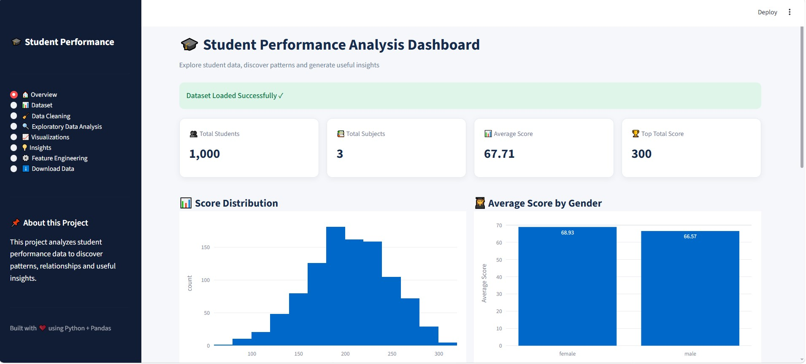
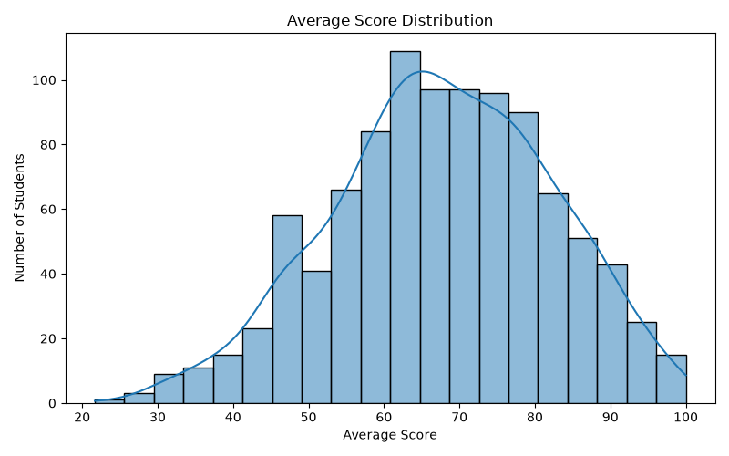
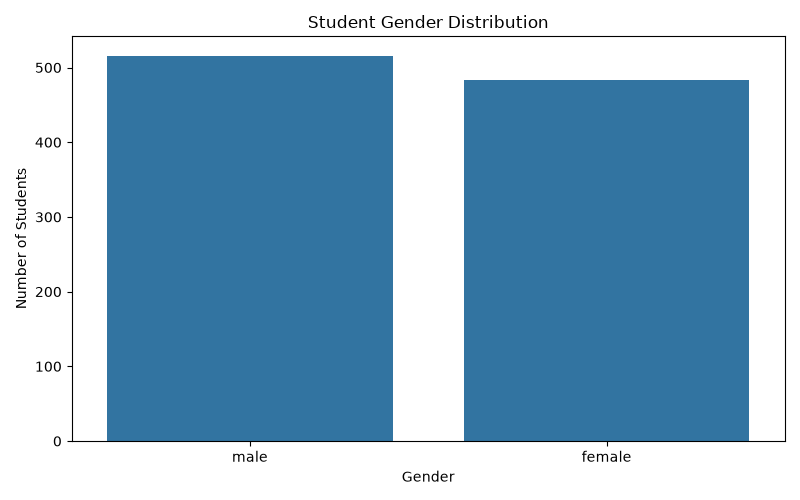
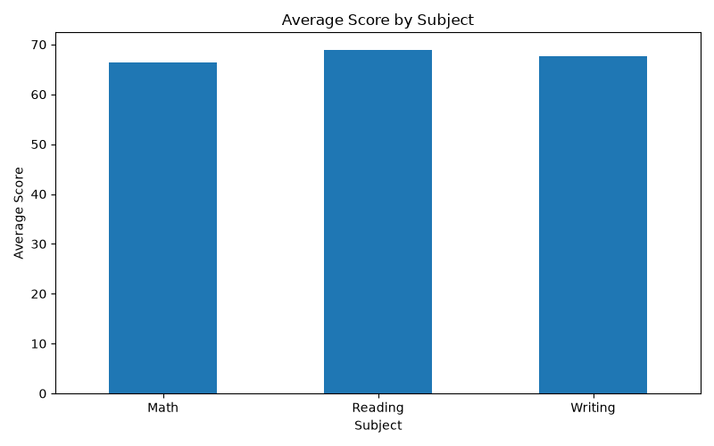
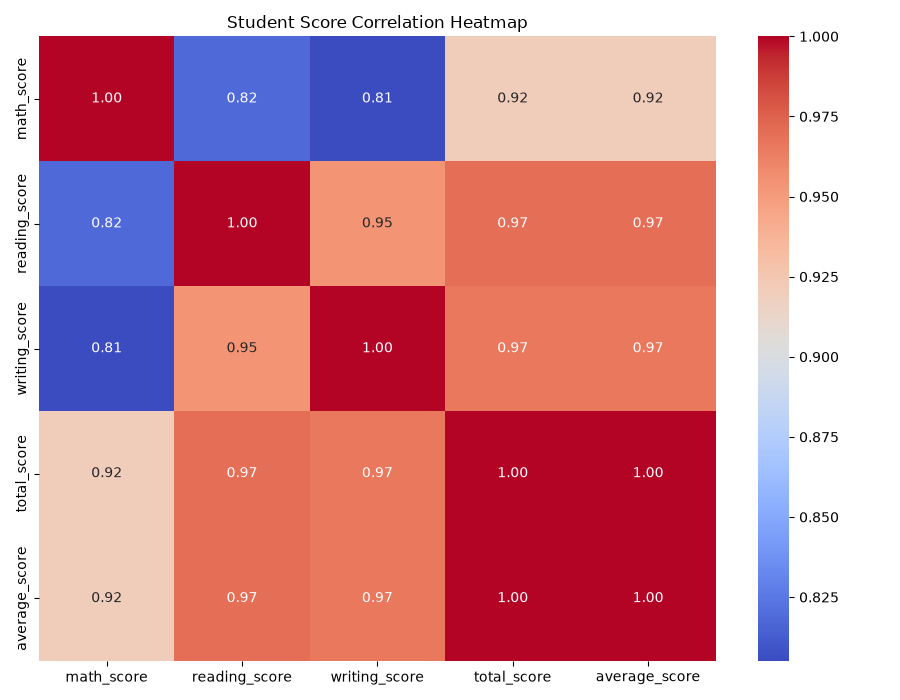
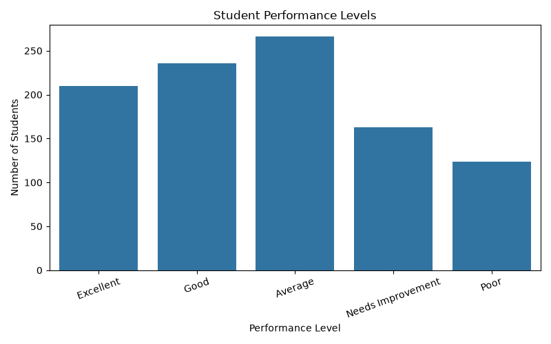

# 🎓 Student Performance Analysis

### Interactive Student Data Analysis & Visualization Project Built with Python

A complete **Student Performance Analysis** project that explores student academic performance using **Python, Pandas, NumPy, Matplotlib, Seaborn, Plotly, and statistical analysis techniques**.

This project focuses on data cleaning, feature engineering, exploratory data analysis, visualization, and extracting meaningful insights from student performance data.

---

# 📖 Overview

Student Performance Analysis is a data analysis project developed using **Python** and popular data science libraries.

The project uses a student performance dataset containing information about:

* Gender
* Race/Ethnicity
* Parental Level of Education
* Lunch
* Test Preparation Course
* Math Score
* Reading Score
* Writing Score

The main goal of this project is to understand student performance patterns, compare subject scores, identify relationships between variables, and generate useful insights from the dataset.

---

# ✨ Features

## 📊 Data Analysis

* Explore student performance data
* Generate statistical summaries
* Analyze subject scores
* Compare student performance
* Analyze performance by gender
* Identify relationships between variables

---

## 🧹 Data Cleaning

* Remove duplicate records
* Handle missing values
* Standardize column names
* Remove unnecessary spaces
* Prepare data for analysis

---

## ⚙️ Feature Engineering

* Calculate total score
* Calculate average score
* Create performance levels
* Generate additional analytical features

---

## 📈 Data Visualization

* Average score distribution
* Gender distribution
* Subject comparison
* Scatter plots
* Box plots
* Correlation heatmap
* Performance-level visualization

---

# 🖥️ Project Dashboard

The project includes a dashboard for exploring the student performance data and visualizing important analysis results.



---

# 📊 Visualizations

## 📈 Average Score Distribution



Shows the distribution of students' overall average scores.

---

## 👥 Gender Distribution



Shows the number of students across different gender categories.

---

## 📚 Subject Comparison



Compares student performance across:

* Mathematics
* Reading
* Writing

---

## 🔥 Correlation Heatmap



Shows relationships between numerical variables and helps identify strongly correlated features.

---

## 🏆 Performance Levels



Groups students according to their overall academic performance.

---

# 📂 Project Structure

```text
Student-Performance-Analysis/
│
├── data/
│   └── StudentPerformance.csv
│
├── images/
│   ├── dashboard.jpg
│   ├── average_score_distribution.png
│   ├── correlation_heatmap.png
│   ├── gender_distribution.png
│   ├── performance_levels.png
│   └── subject_comparison.png
│
├── notebooks/
│   └── analysis.ipynb
│
├── reports/
│
├── src/
│   ├── app.py
│   ├── clean_data.py
│   ├── feature_engineering.py
│   ├── load_data.py
│   └── visualization.py
│
├── .gitignore
├── requirements.txt
└── README.md
```

---

# 🔄 Data Analysis Workflow

```text
Raw Dataset
     │
     ▼
Data Loading
     │
     ▼
Data Cleaning
     │
     ▼
Feature Engineering
     │
     ▼
Exploratory Data Analysis
     │
     ▼
Data Visualization
     │
     ▼
Statistical Analysis
     │
     ▼
Insights & Findings
     │
     ▼
Interactive Dashboard
```

---

# 🛠️ Technologies Used

| Category                  | Technology         |
| ------------------------- | ------------------ |
| Programming Language      | Python             |
| Data Manipulation         | Pandas             |
| Numerical Computing       | NumPy              |
| Visualization             | Matplotlib         |
| Statistical Visualization | Seaborn            |
| Interactive Visualization | Plotly             |
| Statistical Analysis      | Statsmodels        |
| Data Analysis             | Jupyter Notebook   |
| Development Environment   | Visual Studio Code |

---

# 📊 Dataset

The project uses the **Students Performance Dataset**.

The dataset contains information about students and their academic performance.

## Dataset Features

| Feature            | Description              |
| ------------------ | ------------------------ |
| Gender             | Student gender           |
| Race/Ethnicity     | Student group            |
| Parental Education | Parent's education level |
| Lunch              | Lunch program type       |
| Test Preparation   | Test preparation status  |
| Math Score         | Mathematics score        |
| Reading Score      | Reading score            |
| Writing Score      | Writing score            |

### Dataset Size

* **Original Records:** 1,000
* **Features:** 8
* **Records After Removing Duplicates:** 999

---

# 🧹 Data Cleaning

The dataset is cleaned before performing analysis.

### 1️⃣ Remove Duplicates

```python
df = df.drop_duplicates()
```

### 2️⃣ Standardize Column Names

For example:

```text
math score
```

becomes:

```text
math_score
```

### 3️⃣ Remove Extra Spaces

Text values are cleaned to ensure consistency.

### 4️⃣ Handle Missing Values

Missing records are handled before performing the analysis.

---

# ⚙️ Feature Engineering

New features are created to make the analysis more meaningful.

## 📚 Total Score

The total score combines:

```text
Math Score + Reading Score + Writing Score
```

## 📊 Average Score

The average score represents the student's overall academic performance.

```text
Total Score / 3
```

## 🏆 Performance Level

Students are categorized according to their overall performance.

---

# 🔍 Exploratory Data Analysis

The project explores questions such as:

* What is the average student score?
* Which subject has the highest average score?
* How does performance differ by gender?
* How strongly are reading and writing scores related?
* Which students are high performers?
* How are scores distributed?
* Which variables have strong correlations?

---

# 💡 Key Insights

The analysis identifies several important patterns:

* 📚 Reading and writing scores have a strong positive relationship.
* 📊 Student scores are concentrated around the middle-to-high score range.
* 👩‍🎓 Performance varies across different student groups.
* 🏆 Students with consistently high scores across subjects are high performers.
* 🔗 Academic subjects show strong relationships with each other.

---

# 🎯 Learning Objectives

Through this project, I learned:

* Working with real-world datasets
* Loading CSV files
* Data cleaning
* Data preprocessing
* Handling duplicates
* Handling missing values
* Feature engineering
* Exploratory Data Analysis
* Statistical analysis
* Data visualization
* Correlation analysis
* Creating interactive dashboards
* Python project organization
* Writing reusable Python modules

---

# 📚 Skills Demonstrated

## 🐍 Python

* Functions
* Modules
* File handling
* Virtual environments
* Project organization

## 🐼 Pandas

* `read_csv()`
* `head()`
* `tail()`
* `shape`
* `columns`
* `dtypes`
* `isnull()`
* `dropna()`
* `drop_duplicates()`
* `value_counts()`
* `groupby()`
* DataFrame filtering

## 📊 Visualization

* Histograms
* Bar charts
* Scatter plots
* Box plots
* Heatmaps
* Interactive charts

---

# 🏗️ Project Architecture

The project is organized into multiple Python modules.

```text
load_data.py
      │
      ▼
clean_data.py
      │
      ▼
feature_engineering.py
      │
      ▼
visualization.py
      │
      ▼
app.py
      │
      ▼
Interactive Dashboard
```

### Module Description

| File                     | Purpose                          |
| ------------------------ | -------------------------------- |
| `load_data.py`           | Loads the dataset                |
| `clean_data.py`          | Cleans and preprocesses the data |
| `feature_engineering.py` | Creates additional features      |
| `visualization.py`       | Generates data visualizations    |
| `app.py`                 | Runs the application/dashboard   |

---

# 🚀 Quick Start

## 1️⃣ Clone the Repository

```bash
git clone https://github.com/YOUR_GITHUB_USERNAME/Student-Performance-Analysis.git
```

## 2️⃣ Navigate to the Project Folder

```bash
cd Student-Performance-Analysis
```

## 3️⃣ Install Dependencies

```bash
pip install -r requirements.txt
```

## 4️⃣ Run the Project

```bash
python src/app.py
```

---

# ⚙️ Requirements

* Python 3.10+
* Pandas
* NumPy
* Matplotlib
* Seaborn
* Plotly
* Statsmodels

Install the required packages using:

```bash
pip install -r requirements.txt
```

---

# 🚀 Future Improvements

Future versions of this project can include:

* 🤖 Machine Learning prediction
* 📈 Student score prediction
* 🎯 Grade prediction
* 🧠 Student performance classification
* 🌳 Random Forest model
* 📊 Advanced visualizations
* 🔍 Advanced statistical analysis
* 🤖 AI-generated insights
* 📱 Improved responsive dashboard

---

# 🤝 Contributing

Contributions, suggestions, and improvements are welcome.

If you'd like to improve this project:

1. Fork the repository
2. Create a new branch
3. Make your changes
4. Commit your changes
5. Push your changes
6. Open a Pull Request

---

# 👨‍💻 Author

## Muhammad Faizan Aslam

**Software Engineering Student**

* 💻 Python Developer
* 📊 Data Science & Machine Learning Learner
* 🤖 AI Enthusiast
* 👁️ Computer Vision Learner

---

# ⭐ Support

If you found this project useful:

⭐ **Star this repository**

🍴 **Fork the repository**

💡 **Share your feedback**

---

# 📄 License

This project is licensed under the **MIT License**.

---

## 🚀 Part of My Data Science & Machine Learning Learning Journey

### Made with ❤️ using Python, Pandas & Data Visualization
